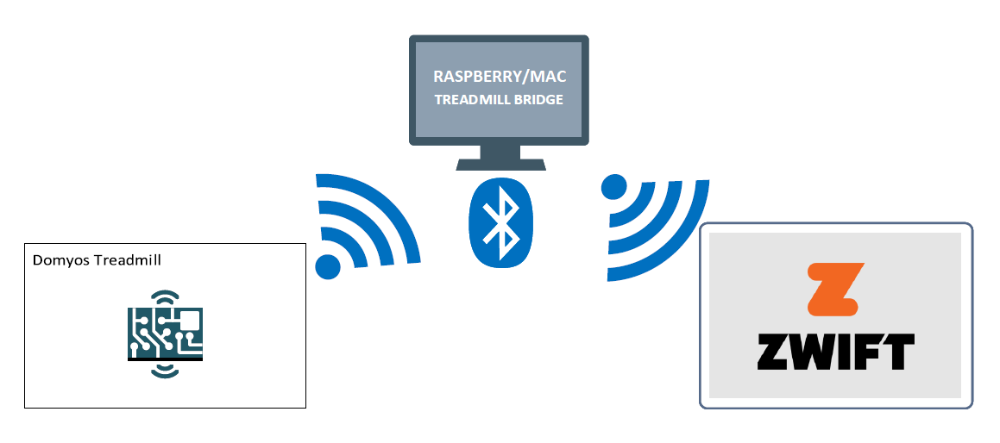
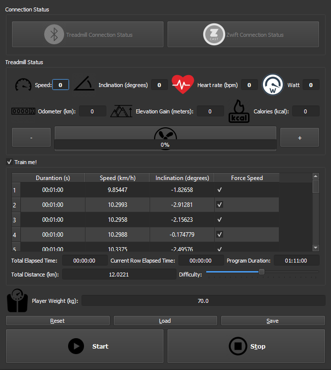
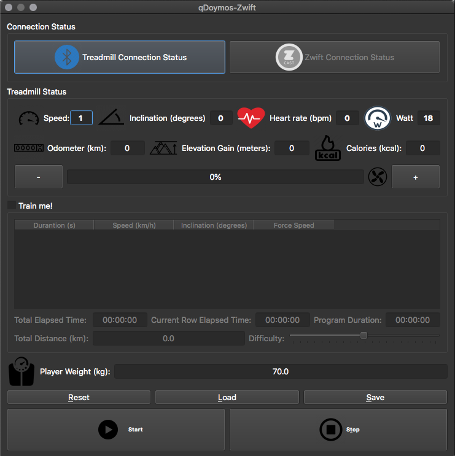

# qdomyos-zwift
Zwift bridge for Treadmills!

UI on Linux

UI on MacOS

### Features

1. Domyos compatible
2. Toorx TRX Route Key comaptible
3. Zwift compatible
4. Create, load and save train programs
5. Measure distance, elevation gain and watts
6. Gpx import (with difficulty slider)
7. Realtime Charts

### Installation from source

$ sudo apt upgrade && sudo apt update # this is very important on raspberry pi: you need the bluetooth firmware updated!

$ sudo apt install git libqt5bluetooth5 libqt5widgets5 libqt5positioning5 libqt5xml5 qtconnectivity5-dev qtpositioning5-dev libqt5charts5-dev libqt5charts5

$ git clone https://github.com/cagnulein/qdomyos-zwift.git

$ cd src

$ qmake

$ make -j4

$ sudo ./qdomyos-zwift

### MacOs installation

You will need to (at a minimum) to install the xcode Command Line Tools (CLI) thanks to @richardwait
https://developer.apple.com/download/more/?=xcode

Download and install http://download.qt.io/official_releases/qt/5.12/5.12.9/qt-opensource-mac-x64-5.12.9.dmg and simply run the qdomyos-zwift relase for MacOs

### Tested on

- Raspberry PI 0W and Domyos Intense Run

- MacBook Air 2011 and Domyos Intense Run

- Raspberry 3b+ and Toorx TRX Route Key

### No gui version

run as

$ sudo ./qdomyos-zwift -no-gui

### Reference

https://github.com/ProH4Ck/treadmill-bridge

https://www.livestrong.com/article/422012-what-is-10-degrees-in-incline-on-a-treadmill/

### Blog

https://robertoviola.cloud
