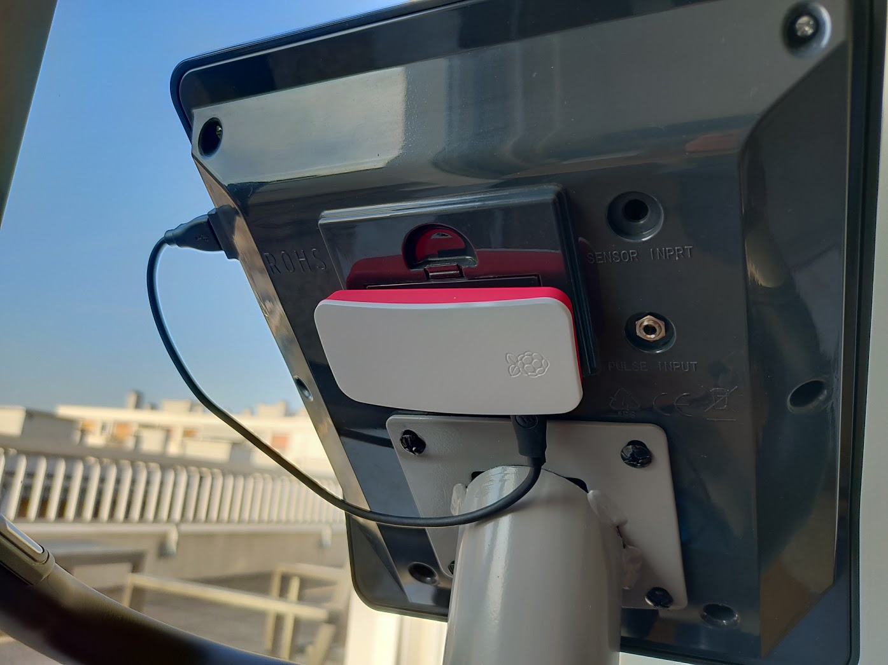
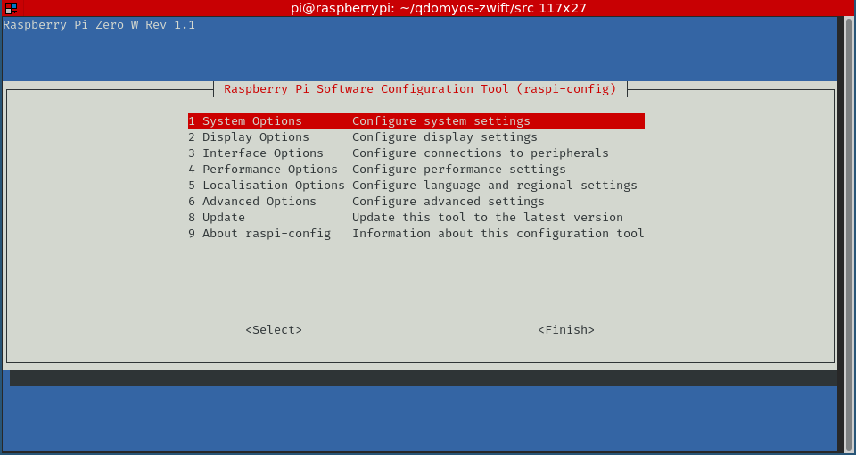
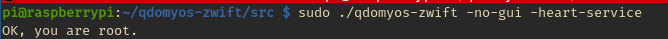
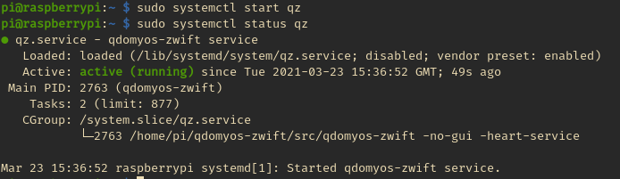

# Installation

QDomyos-Zwift can be installed from source on MacOs, Linux, Android and IOS.

Once you've installed QDomyos-Zwift, you can access the [operation guide](30_usage.md) for more information.

These instructions build the app itself, not the test project.

## On a Linux System (from source)

```buildoutcfg
$ sudo apt update && sudo apt upgrade # this is very important on raspberry pi: you need the bluetooth firmware updated!
$ sudo apt install git qtquickcontrols2-5-dev libqt5bluetooth5 libqt5widgets5 libqt5positioning5 libqt5xml5 qtconnectivity5-dev qtbase5-private-dev qtpositioning5-dev libqt5charts5-dev libqt5charts5 qt5-assistant libqt5networkauth5-dev libqt5websockets5-dev qml-module* libqt5texttospeech5-dev libqt5texttospeech5 libqt5location5-plugins qtlocation5-dev qtmultimedia5-dev libqt5multimediawidgets5 libqt5multimedia5-plugins libqt5multimedia5 g++ make libqt5sql5-dev libqt5sql5 libqt5sql5-mysql libqt5sql5-psql
$ git clone https://github.com/cagnulein/qdomyos-zwift.git
$ cd qdomyos-zwift
$ git submodule update --init src/smtpclient/
$ git submodule update --init src/qmdnsengine/
$ git submodule update --init tst/googletest/
$ cd src
$ qmake qdomyos-zwift.pro
$ make -j4
$ sudo ./qdomyos-zwift
```


## MacOs installation

You will need to (at a minimum) to install the xcode Command Line Tools (CLI) thanks to @richardwait
https://developer.apple.com/download/more/?=xcode

Download and install https://download.qt.io/archive/qt/5.12/5.12.12/qt-opensource-mac-x64-5.12.12.dmg and simply run the qdomyos-zwift release for MacOs

## On Raspberry Pi Zero W



This guide will walk you through steps to setup an autonomous, headless raspberry bridge.


### Initial System Preparation

You can install a lightweight version of embedded OS to speed up your raspberry booting time.

#### Prepare your SD Card 
Get the latest [Raspberry Pi Imager](https://www.raspberrypi.org/software/) and install, on a SD card, the Raspberry lite OS version.  
Boot on the raspberry (default credentials are pi/raspberry)

#### Change default credentials

`sudo raspi-config` > `Password`

##### Setup Wifi


`sudo raspi-config`
`System Options` > `Wireless LAN`
Enter an SSID and your wifi password.

Your raspberry will fetch a DHCP address at boot time, which can be painful : 
- The IP address might change at every boot
- This process takes approximately 10 seconds at boot time.

It is recommended to set a fixed IP address

#### (optional) Set Fixed IP address 
Edit `/etc/dhcpcd.conf` and insert the following content with your configuration. 

```bash
# Example static IP configuration:
interface wlan0
static ip_address=192.168.1.99/24
static routers=192.168.1.1
static domain_name_servers=192.168.1.1 8.8.8.8 
```

Apply the changes `sudo systemctl restart dhcpcd.service` and ensure you have internet access.

#### Enable SSH access

You might want to access your raspberry remotely while it is attached to your fitness equipment. 

`sudo raspi-config` > `Interface Options` > `SSH`

#### Do not wait for network at boot

This option allows a faster boot. `sudo raspi-config` > `System Options` > `Network at boot` > `No`

#### Reboot and test connectivity 
Reboot your raspberry `sudo reboot now`

Congratulations !  
Your raspberry should be reachable from your local network via SSH.


### QDOMYOS-ZWIFT installation

#### Update your raspberry (mandatory !)

Before installing qdomyos-zwift, let's ensure we have an up-to-date system.

`sudo apt-get update`  
`sudo apt-get upgrade`

This operation takes a moment to complete.

#### Install qdomyos-zwift from sources

```bash
sudo apt install git libqt5bluetooth5 libqt5widgets5 libqt5positioning5 libqt5xml5 qtconnectivity5-dev qtbase5-private-dev qtpositioning5-dev libqt5charts5-dev libqt5charts5 qt5-assistant libqt5networkauth5-dev libqt5websockets5-dev qtmultimedia5-dev libqt5multimediawidgets5 libqt5multimedia5-plugins libqt5multimedia5 qtlocation5-dev qtquickcontrols2-5-dev libqt5texttospeech5-dev libqt5texttospeech5 g++ make libqt5sql5-dev libqt5sql5 libqt5sql5-mysql libqt5sql5-psql
git clone https://github.com/cagnulein/qdomyos-zwift.git
cd qdomyos-zwift
git submodule update --init src/smtpclient/  
git submodule update --init src/qmdnsengine/  
git submodule update --init tst/googletest/
cd src
qmake qdomyos-zwift.pro    
make  
```

If you need GUI also do a
```
apt install qml-module*
```

Please note :
- Don't build the application with `-j4` option (this will fail)
- Build operation is circa 45 minutes (subsequent builds are faster)

#### Test your installation 
It is now time to check everything's fine 

`./qdomyos-zwift -no-gui -heart-service`



Test your access from your fitness device. 

#### Automate QDOMYOS-ZWIFT at startup

You might want to have QDOMYOS-ZWIFT to start automatically at boot time. 

Let's create a systemd service that we'll enable at boot sequence.

`sudo vi /lib/systemd/system/qz.service`

```buildoutcfg
[Unit]
Description=qdomyos-zwift service
After=multi-user.target

[Service]
Type=idle  
Restart=always
RestartSec=30
ExecStart=/home/pi/qdomyos-zwift/src/qdomyos-zwift -no-gui -no-log -heart-service
ExecStop=killall -9 qdomyos-zwift
User=root  

[Install]  
WantedBy=multi-user.target 
```

Once your file saved, you need to reload the active systemd configuration.  
`sudo systemctl daemon-reload`

Test your service to check if everything's fine :

`sudo systemctl start qz`



Check if your system is stopping correctly :
`sudo systemctl stop qz`

If everything is working as expected, **enable your service at boot time** :  
`sudo systemctl enable qz`

Then reboot to check operations (`sudo reboot`)

### (optional) Treadmill Auto-Detection and Service Management
This section provides a reliable way to manage the QZ service based on the treadmill's power state. Using a `bluetoothctl`-based Bash script, this solution ensures the QZ service starts when the treadmill is detected and stops when it is not.

- **Bluetooth Discovery**: Monitors treadmill availability via `bluetoothctl`.
- **Service Control**: Automatically starts and stops the QZ service.
- **Logging**: Tracks treadmill status and actions in a log file.

**Notes:**
- Ensure `bluetoothctl` is installed and working on your system.
- Replace `I_TL` in the script with your treadmill's Bluetooth name. You can find your device name via `bluetoothctl scan on`
- Adjust the sleep interval (`sleep 30`) in the script as needed for your use case.

Step 1: Save the following script as `/root/qz-treadmill-monitor.sh`:
```bash
#!/bin/bash

LOG_FILE="/var/log/qz-treadmill-monitor.log"
TARGET_DEVICE="I_TL"
SCAN_INTERVAL=30  # Time in seconds between checks
SERVICE_NAME="qz"
DEBUG_LOG_DIR="/var/log"  # Directory where QZ debug logs are stored
ERROR_MESSAGE="BTLE stateChanged InvalidService"

log() {
    echo "$(date '+%Y-%m-%d %H:%M:%S') - $1" >> "$LOG_FILE"
}

is_service_running() {
    systemctl is-active --quiet "$SERVICE_NAME"
    return $?
}

scan_for_device() {
    log "Starting Bluetooth scan for $TARGET_DEVICE..."

    # Run bluetoothctl scan in the background and capture output
    bluetoothctl scan on &>/dev/null &
    SCAN_PID=$!

    # Allow some time for devices to appear
    sleep 5

    # Check if the target device appears in the list
    bluetoothctl devices | grep -q "$TARGET_DEVICE"
    DEVICE_FOUND=$?

    # Stop scanning
    kill "$SCAN_PID"
    bluetoothctl scan off &>/dev/null

    if [ $DEVICE_FOUND -eq 0 ]; then
        log "Device '$TARGET_DEVICE' found."
        return 0
    else
        log "Device '$TARGET_DEVICE' not found."
        return 1
    fi
}

restart_qz_on_error() {
    # Get the current date
    CURRENT_DATE=$(date '+%a_%b_%d')
    
    # Find the latest QZ debug log file for today
    LATEST_LOG=$(ls -t "$DEBUG_LOG_DIR"/debug-"$CURRENT_DATE"_*.log 2>/dev/null | head -n 1)
    
    if [ -z "$LATEST_LOG" ]; then
        log "No QZ debug log found for today."
        return 0
    fi

    log "Checking latest log file: $LATEST_LOG for errors..."

    # Search the latest log for the error message
    if grep -q "$ERROR_MESSAGE" "$LATEST_LOG"; then
        log "***** Error detected in QZ log: $ERROR_MESSAGE *****"
        log "Restarting QZ service..."
        systemctl restart "$SERVICE_NAME"
    else
        log "No errors detected in $LATEST_LOG."
    fi
}

manage_service() {
    local device_found=$1
    if $device_found; then
        if ! is_service_running; then
            log "***** Starting QZ service... *****"
            systemctl start "$SERVICE_NAME"
        else
            log "QZ service is already running."
            restart_qz_on_error  # Check the log for errors when QZ is already running
        fi
    else
        if is_service_running; then
            log "***** Stopping QZ service... *****"
            systemctl stop "$SERVICE_NAME"
        else
            log "QZ service is already stopped."
        fi
    fi
}

while true; do
    log "Checking for treadmill status..."
    if scan_for_device; then
        manage_service true
    else
        manage_service false
    fi
    log "Waiting for $SCAN_INTERVAL seconds before next check..."
    sleep "$SCAN_INTERVAL"
done
```

Step2: To ensure the script runs continuously, create a systemd service file at `/etc/systemd/system/qz-treadmill-monitor.service`
```bash
[Unit]
Description=QZ Treadmill Monitor Service
After=bluetooth.service

[Service]
Type=simple
ExecStart=/root/qz-treadmill-monitor.sh
Restart=always
RestartSec=10
User=root

[Install]
WantedBy=multi-user.target
```

Step 3: Enable and Start the Service
```bash
sudo systemctl daemon-reload
sudo systemctl enable qz-treadmill-monitor
sudo systemctl start qz-treadmill-monitor
```

Monitor logs are written to `/var/log/qz-treadmill-monitor.log`. Use the following command to check logs in real-time:
```bash
sudo tail -f /var/log/qz-treadmill-monitor.log
```


### (optional) Enable overlay FS

Once that everything is working as expected, and if you dedicate your Raspberry pi to this usage, you might want to enable the read-only overlay FS.

By enabling the overlay read-only system, your SD card will be read-only only and every file written will be to RAM.
Then at each reboot the RAM is erased and you'll revert to the initial status of the overlay file-system.

Why doing that ?
- Your SD card will not suffer any write operation and will life longer.
- The risk of corruption of your FS is reduced (in case of unproper shutdown in example)
- This operation is reversible.

**ATTENTION**  
After enabling the overlay filesystem any change on your SDCard will become a temporary change.  
In the case you need to update qdomyos-zwift (in example), you'll need to disable the overlay filesystem first. 

`sudo raspi-config` > `Performance` > `Overlay File system`

"Would you like the overlay filesystem to be enabled ?" YES.

"Would you like the boot partition to be read-only ?" YES.

Reboot immediately.
 

## Other tricks 

I use some [3m magic scratches](https://www.amazon.fr/Command-Languettes-Accrochage-Tableaux-Larges/dp/B00X7792IE/ref=sr_1_5?dchild=1&keywords=accroche+tableau&qid=1616515278&sr=8-5) to attach my raspberry to my bike.
I use the USB port from the bike console (always powered as long as the bike is plugged to main), maximum power is 500mA and this is enough for the raspberry.

You can easily remove the raspberry pi from the bike if required.
