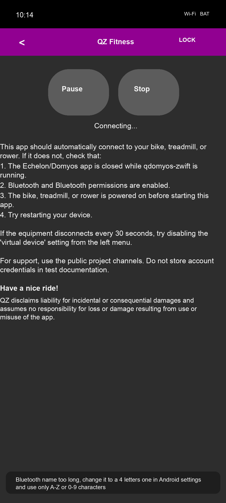
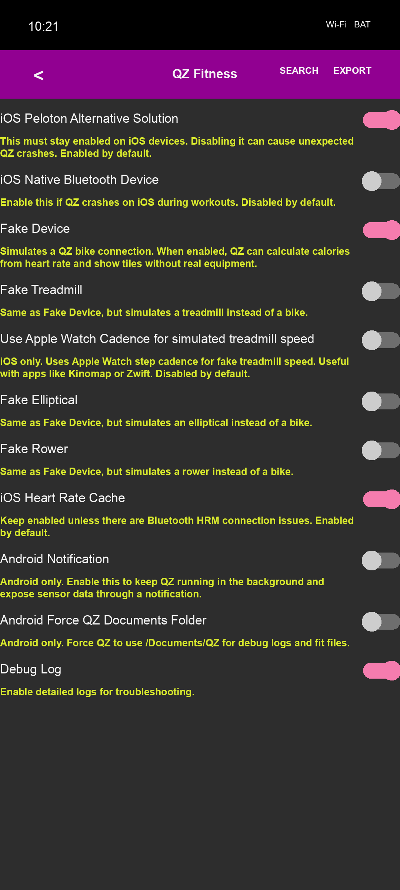

# QZ on Android - Testing Guide

## App Installed on the Emulator

- **Package:** `org.cagnulen.qdomyoszwift`
- **Main activity:** `.CustomQtActivity`
- **Tested version:** 2.21.5
- **AVD:** `Pixel_8_API_36` (Android 15 / API 36, arm64 architecture)

## Quick Start with adb

```bash
ADB=~/Library/Android/sdk/platform-tools/adb

# Start the emulator if it is not already running.
~/Library/Android/sdk/emulator/emulator -avd Pixel_8_API_36 -no-snapshot-load &

# Wait for the boot to complete.
$ADB wait-for-device shell getprop sys.boot_completed
# Returns "1" when it is ready.

# Launch QZ.
$ADB shell am start -n org.cagnulen.qdomyoszwift/.CustomQtActivity

# Stop QZ.
$ADB shell am force-stop org.cagnulen.qdomyoszwift
```

## UI Navigation

QZ uses Qt Quick (QML), so the standard Android accessibility tree is not always accurate.

| Element | Action | Coordinates (1080x2400) |
|---|---|---|
| Side menu (drawer) | Tap the left arrow in the top-left corner | `tap 78 193` |
| Settings | Tap inside the drawer after opening it | `tap 175 300` |
| Lock tile (unlock tiles) | Tap the lock icon at the top | `tap 860 180` |

Open the drawer:
```bash
$ADB shell input tap 78 193
```

Go to Settings:
```bash
$ADB shell input tap 78 193   # open drawer
sleep 1
$ADB shell input tap 175 300  # tap "Settings"
```

## Settings Structure

The Settings page contains a scrollable list:
- General / bike / heart rate / ANT+ options
- Zwift / Peloton / Rouvy / Garmin options
- Treadmill / rower / elliptical options
- Advanced / accessories / TTS / maps settings
- **Experimental Features** at the bottom, expandable with the vertical arrow button

Scroll to Experimental Features:
```bash
$ADB shell input swipe 540 1500 540 500 400  # scroll up; repeat 3 times
$ADB shell input tap 976 2290                 # expand Experimental Features
$ADB shell input swipe 540 1800 540 800 400   # scroll down to show toggles; repeat 4 times
```

## Key Settings for Zwift Testing

### Configuration File

QZ uses Qt QSettings, stored as an INI file on Android:
```text
/data/data/org.cagnulen.qdomyoszwift/files/.config/Roberto Viola/qDomyos-Zwift.conf
```

Read the current configuration:
```bash
$ADB shell "run-as org.cagnulen.qdomyoszwift sh -c 'cat /data/data/org.cagnulen.qdomyoszwift/files/.config/Roberto\ Viola/qDomyos-Zwift.conf'"
```

Write settings directly while QZ is stopped:
```bash
$ADB shell am force-stop org.cagnulen.qdomyoszwift

$ADB shell "run-as org.cagnulen.qdomyoszwift sh -c '
  mkdir -p \"/data/data/org.cagnulen.qdomyoszwift/files/.config/Roberto Viola\"
  printf \"[General]\nandroid_notification=true\napplewatch_fakedevice=true\n\" \
    > \"/data/data/org.cagnulen.qdomyoszwift/files/.config/Roberto Viola/qDomyos-Zwift.conf\"
'"
```

### Settings Key to UI Mapping (Experimental Features)

| INI key | UI label (EN) | Default | Notes |
|---|---|---|---|
| `android_notification` | Android Notification | false | Required for same-device Zwift testing |
| `applewatch_fakedevice` | Fake Device | false | Simulates a bike when no real device is connected |
| `virtual_device_enabled` | Enable Virtual Device | true | Enables the virtual FTMS/CSCS bridge |
| `virtual_device_bluetooth` | Virtual Device Bluetooth | true | Enables Bluetooth for the virtual device |
| `fakedevice_treadmill` | Fake Treadmill | false | Simulates a treadmill instead of a bike |
| `fakedevice_elliptical` | Fake Elliptical | false | Simulates an elliptical |
| `fakedevice_rower` | Fake Rower | false | Simulates a rower |

### Recommended Configuration for Same-Device Zwift Testing

```ini
[General]
android_notification=true
applewatch_fakedevice=true
```

After writing the configuration, start QZ and verify that the foreground notification is present:
```bash
$ADB shell am start -n org.cagnulen.qdomyoszwift/.CustomQtActivity
sleep 5
$ADB shell dumpsys notification | grep -A3 "qdomyos"
# It should show ForegroundServiceChannel with at least one posted notification.
```

## Verify Toggle State with UI Automator

```bash
$ADB shell uiautomator dump /sdcard/ui.xml
$ADB pull /sdcard/ui.xml /tmp/ui.xml
python3 -c "
import xml.etree.ElementTree as ET
tree = ET.parse('/tmp/ui.xml')
root = tree.getroot()
def find_all(node):
    desc = node.get('content-desc', '')
    if node.get('checkable') == 'true' and desc and node.get('bounds') != '[0,0][0,0]':
        print(f'  {node.get(\"checked\")} - {desc[:60]}')
    for child in node:
        find_all(child)
find_all(root)
"
```

## Reference Screenshots


*QZ main screen on first launch, with no account data shown.*


*Experimental Features with Fake Device and Android Notification visible.*

## Notes

- The emulator Bluetooth name is too long for QZ. QZ warns: "Bluetooth name too long, change it to a 4 letters one". This does not affect same-device Zwift tests through Android notifications.
- Account credentials should stay in the password manager on physical devices.
- For physical devices on the network, use `adb connect <IP>:5555`.
