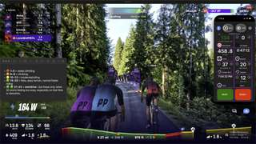
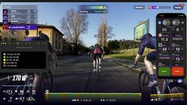

# ROUVY

## Can I use QZ virtual gears with ROUVY?

Yes. QZ can manage virtual gear changes while ROUVY controls the bike or trainer through QZ. ROUVY continues sending terrain/grade changes, while QZ applies the current virtual gear on top of the resistance requested for the route.

You can change QZ virtual gears using several controls, depending on your setup:

- the **Gear - / Gear +** buttons in QZ;
- a **CYCPLUS BC2** handlebar controller;
- **Zwift Click**, **Zwift Play**, or **Zwift Ride** controllers;
- a Bluetooth media/volume remote when **volume buttons change gears** is enabled;
- on a supported RENPHO bike, the physical resistance knob when the RENPHO knob-to-gears option is enabled.

## How can I see the current QZ gear while riding in ROUVY?

The current virtual gear is managed by QZ. ROUVY does not currently provide a field where QZ can inject its gear number, so you should not expect the QZ gear to appear natively in the ROUVY ride screen.

Keep the QZ **Gear** tile visible if you want to see the current gear while riding. For example, when QZ runs on an iPhone and ROUVY runs on a Mac, iPhone Mirroring can be used to keep the Gear tile visible next to the ROUVY window.

## Confirmed setup: RENPHO R-Q002 + ROUVY + CYCPLUS BC2

A real-world setup has been tested successfully with:

- **RENPHO R-Q002 / R-Q002 E** smart bike;
- QZ running on an iPhone;
- ROUVY running on a MacBook Pro;
- **ROUVY Compatibility** enabled in QZ, with ROUVY connected to QZ over the Wi-Fi/DIRCON virtual-trainer path;
- **Bike Resistance Offset = 8** for this rider;
- a **24-gear Custom Gear Table**;
- a **CYCPLUS BC2** on the handlebars for Gear - / Gear +.

In this configuration the route still changes resistance automatically with the terrain, while the BC2 changes the QZ virtual gear. This is especially useful on descents: instead of spinning out when the route reduces the base resistance, the rider can shift into a harder virtual gear and keep useful pedal resistance.

The RENPHO physical knob can also be used first to tune and test the virtual gear range. Once the preferred range is established, the BC2 can take over handlebar shifting without changing the underlying ROUVY terrain-response setup.

`Bike Resistance Offset = 8` and the exact 24-gear table are values from this confirmed setup, not universal defaults. Other riders may prefer a different baseline or gear table.

*Screenshots courtesy of Colby Brannon, shared with permission.*

## Can I use a Bluetooth media/volume remote to shift in ROUVY?

Yes. Enable QZ's **volume buttons change gears** option and use a Bluetooth media/volume remote that sends volume-up and volume-down key events. QZ handles those key events as gear controls.

On Android, the system volume overlay may still briefly appear when those keys are pressed; that does not prevent QZ from using the key presses for gear changes.
